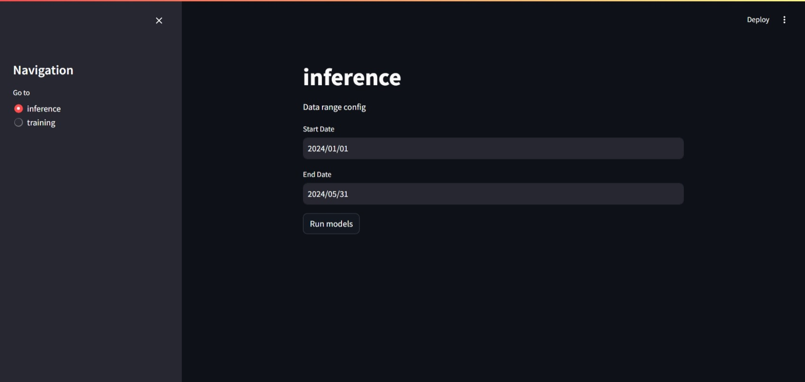
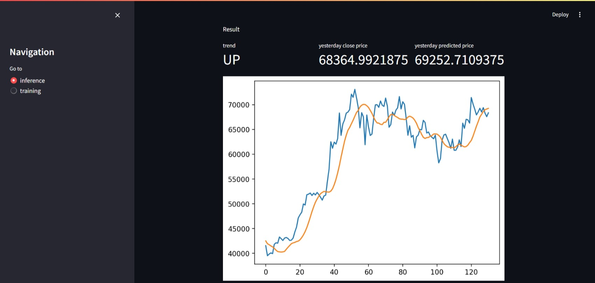
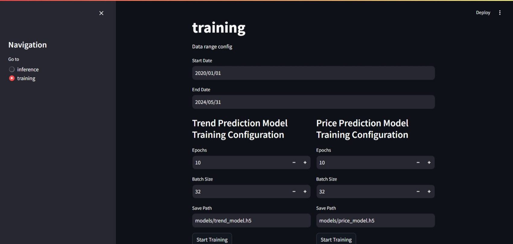

# CRYPTO-PREDICT

This is our project for DSP391m at FPT University. In this project, we applied **LSTM** to crypto price data to predict the **trend** and the **price**. The project contains training and testing pipeline for crypto trend and price.
<br> <br> Main pipeline of the project:

1. Collect data: we use API of [yahoo-finance](https://github.com/ranaroussi/yfinance)
2. Applied technical analysis to extract 5 features of the close price
    - MACD histogram
    - Stochastic RSI
    - Detrended Price Oscillator
    - Coppock Curve
    - Interpolation of price
3. 5 features extracted -> predict crypto trend.
4. trend + close price -> predict crypto price.

## Table of Contents

1. [Installation](#installation)
2. [Usage](#usage)
3. [Features](#features)
4. [References](#references)

## Installation

*Note: the project was implemented using Python 3.9+*

```bash
# Clone the repository
git clone https://github.com/jayllfpt/crypto-predict.git

# Navigate to the project directory
cd crypto-predict

# Install dependencies
pip install -r requirement.txt
```

*Note: We highly recommend using [conda/miniconda](https://docs.anaconda.com/free/miniconda/index.html) in order to avoid environment conflict.*

## Usage

1. Run with streamlit

```bash
streamlit run app.py
```

2. Run with python
<br>*Have a look at [trend predict module](./trends/TrendPredict.py), [price predict module](./prices/PricePredict.py) and [full pipeline](./pipeline.py)*
```bash
python pipeline.py
```


3. Run with docker
<br>*Have a look at [Dockerfile]("./Dockerfile")*

```bash
# build image
docker build -t dsp .
# run container
docker run -p 1234:1234 --name DSP dsp
```

## Features

When you run the app with streamlit, there will be 2 pages

- [inference page](#inference-page)
- [training page](#training-page)

#### Inference page


Select the start date and end date, and the model will predict on the dataset you choose



#### Training page



This page contains configs for training **trend** and **price** models. Including:
1. Data range: Data used for training
2. Epochs: number of epochs
3. Batch size: batch size


## License

State the license under which your project is distributed.

This project is licensed under the MIT License - see the [LICENSE](LICENSE) file for details.

## References
1. [LSTM-Crypto-Price-Prediction](https://github.com/SC4RECOIN/LSTM-Crypto-Price-Prediction/tree/master)
2. [How to build a real-time live dashboard with Streamlit](https://blog.streamlit.io/how-to-build-a-real-time-live-dashboard-with-streamlit/)
3. [Predicting Crypto Prices in Python](https://www.youtube.com/watch?v=GFSiL6zEZF0)

